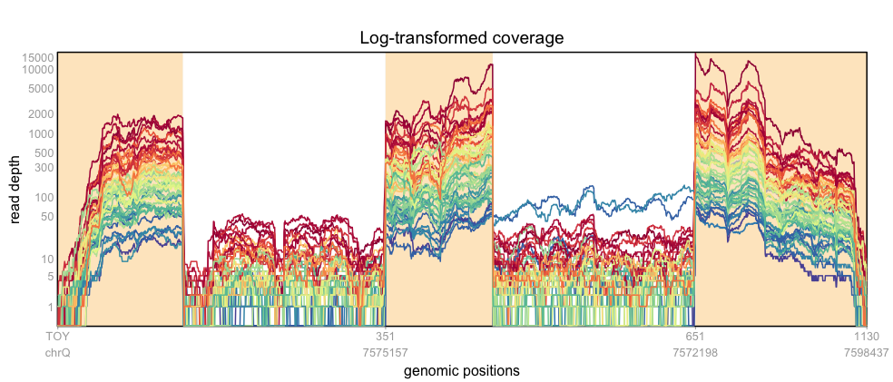

# Tutorial 

This tutorial is for a single gene analysis with `SCISSOR`. For more information, you can find R documentation for each function using `?function`. E.g.:

```r
?read_BAM
```

## Get gene annotation

If you have gene annotation (genomic coordinates for exons) for your gene, you can skip this step. If this is not the case, you can use `build_gaf` to obtain gene annotation from GTF file. Make sure that you specify a gene symbol, e.g. TP53, as an input in `build_gaf`.

```r
Gene="TP53"
regions=build_gaf(Gene=Gene,GTF.file="./Homo_sapiens.GRCh37.87.gtf")
```

Suppose that GTF file have information about our hypothetical gene, "TOY". Then, the `build_gaf` gives the exons for the gene "TOY", and the output will be something like:

```r
> regions
[1] "chrQ:7571719-7572198,7574858-7575157,7598088-7598437:-"
```

## Get coverage from BAM files

SCISSOR takes base-level pileup for a single gene as an input. If you want to get the pileup data from BAM files, you can use `read_BAM`. Suppose that your BAM files are located under the directory, ~/bamDir/. You can read the part of the BAM files for particular regions of interest into R. Then, the resulting data object **pileup** is a matrix where samples are in columns and genomic coordinates are in rows. If you have IDs for your samples, you can specify them for the argument `caseIDs`. 

```r
BAMfiles=list.files(path="~/bamDir/")
BAMfilesPath=as.character(sapply(BAMfiles[1:3],function(x) paste(getwd(),x,sep="/")))
pileup=read_BAM(BAMfiles=bamfilesPath,caseIDs=case.barcodes,
                symbol=Gene,regions=regions,outputType=outputType)
```

## Get genomic ranges for analysis

The next important step of SCISSOR is to get genomic ranges for the gene of interest using `get_Ranges`. 

```r
outputType="part_intron"
geneRanges = get_Ranges(Gene=Gene,regions=regions,outputType=outputType)
```

## Plot coverage

```r
plot_pileup(Pileup=pileupData,Ranges=Ranges,cases=randomSamples,
            main="Raw coverage")
```


```r
plot_pileup(Pileup=log10(pileupData+1),Ranges=Ranges,cases=randomSamples,
            main="Log-transformed coverage",logcount=1)
```




## Run SCISSOR

`Scissor` is all-in-one function performing transformation, normalization, and the statistical analysis. 

We have base-level pileup data (as the object, **pileup**) and genomic ranges (as the object, **geneRanges**) from the previous steps. `Scissor` takes these as inputs with other options to  identify various types of structural changes such as abnormal splicing (exon skipping and intron retention), alternative transcription start or termination, small deletions, and etc. You can use `Scissor` as the following simple command:

```r
ScissorOutput=Scissor(pileupData=pileup,Ranges=Ranges)
```

`Scissor` performs:

* logarithmic transformation by automatically choosing the log shift parameter
* base-level normalization   
* global shape change detection by exploring all possible low-dimensional space   
* local shape change detection by exploring residual space   


`Scissor` provides:

* shape changes identified
* outlyingness scores (global and local)  
* cutoff values (global and local)    
* most outlyingness directions for the identified shape changes   

For more information, see the R documentaion: `?Scissor` or `help(Scissor)`. 


